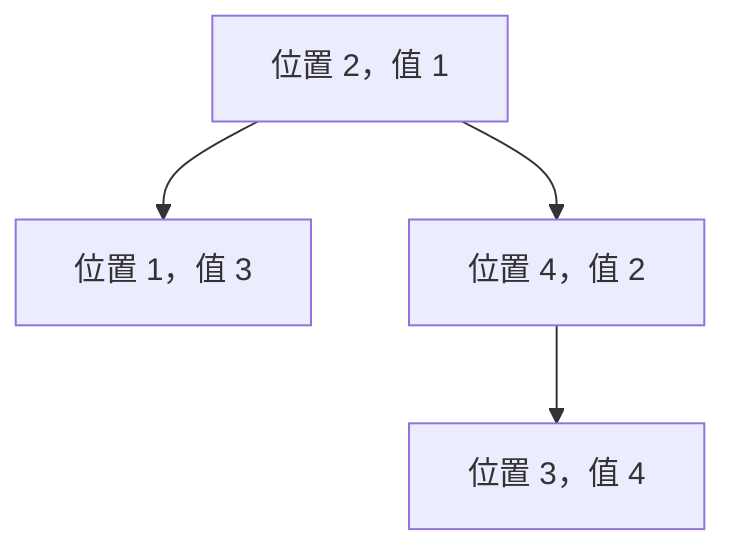

# 笛卡尔树

笛卡尔树把一个序列同时表示成二叉搜索树与堆。它最有价值的地方不是“又一种树”，而是把序列中的区间最值关系转化为祖先关系。

## 定义

给定互异序列 $a_1,a_2,\ldots,a_n$，以位置 $i$ 作为节点编号。小根笛卡尔树同时满足：

1. 中序遍历节点编号得到 $1,2,\ldots,n$；
2. 每个节点的权值不大于孩子权值。

因此整棵树的根必然是序列最小值的位置；根左边的下标属于左子树，右边的下标属于右子树。

例如序列 `3 1 4 2`：值 1 的位置 2 是根；位置 1 是左孩子；右侧子序列 `4 2` 中，值 2 的位置 4 是右子树根，位置 3 是它的左孩子。



图的中序遍历仍是 `1,2,3,4`，从上到下又满足小根堆性质。

## 朴素递归为什么会慢

可以在每个区间找最小值作为根，再递归左右区间。但递增序列的最小值总在区间左端：

$$
T(n)=T(n-1)+O(n)=O(n^2).
$$

要达到线性时间，必须复用“前缀的笛卡尔树”并快速找到新节点应接入的位置。

## 单调栈构造

从左到右加入位置 $i$。维护一条从根向右走得到的链，其权值单调递增；这条链正是可能成为新节点祖先的位置。

1. 不断弹出权值大于 $a_i$ 的栈顶，最后一个被弹出的节点记为 `last`。
2. 若栈仍非空，栈顶是左侧第一个权值更小的候选祖先，令它的右孩子为 $i$。
3. 令 `last` 成为 $i$ 的左孩子。
4. 把 $i$ 压栈。

为什么 `last` 是左孩子？被弹出的节点下标都在 $i$ 左侧，其中最后弹出的节点是这段旧右链最高的根；整段结构必须保持中序顺序，所以挂到 $i$ 的左侧。

```cpp
vector<int> leftChild(n + 1), rightChild(n + 1), stackIndex;
for (int i = 1; i <= n; ++i) {
    int last = 0;
    while (!stackIndex.empty() && a[stackIndex.back()] > a[i]) {
        last = stackIndex.back();
        stackIndex.pop_back();
    }
    if (!stackIndex.empty()) rightChild[stackIndex.back()] = i;
    leftChild[i] = last;
    stackIndex.push_back(i);
}
int root = stackIndex.front();
```

每个位置入栈一次、出栈至多一次，所以总时间 $O(n)$，空间 $O(n)$。

## 正确性不变量

处理完前 $i$ 个位置后：

- 已构造部分的中序遍历是 $1..i$；
- 每条父子边满足小根堆性质；
- 栈保存从根到最右节点的一条链，且权值单调递增。

加入 $i+1$ 时，它的下标最大，只可能接在最右链上。弹出所有比它大的节点后，剩余栈顶可以作为父亲；被弹出的整段又都比新节点大，挂到新节点左侧仍满足堆性质。因此三项不变量继续成立。

## 真题：P5854 笛卡尔树

[洛谷 P5854【模板】笛卡尔树](https://www.luogu.com.cn/problem/P5854) 给出一个排列，要求构造小根笛卡尔树，并按题目公式异或左右孩子编号。排列保证权值互异，树因此唯一。

```cpp
#include <bits/stdc++.h>
using namespace std;

int main() {
    ios::sync_with_stdio(false);
    cin.tie(nullptr);

    int n;
    cin >> n;
    vector<int> value(n + 1), leftChild(n + 1), rightChild(n + 1);
    vector<int> stackIndex;
    stackIndex.reserve(n);
    for (int i = 1; i <= n; ++i) cin >> value[i];

    for (int i = 1; i <= n; ++i) {
        int last = 0;
        while (!stackIndex.empty() && value[stackIndex.back()] > value[i]) {
            last = stackIndex.back();
            stackIndex.pop_back();
        }
        if (!stackIndex.empty()) rightChild[stackIndex.back()] = i;
        leftChild[i] = last;
        stackIndex.push_back(i);
    }

    long long answerLeft = 0, answerRight = 0;
    for (int i = 1; i <= n; ++i) {
        answerLeft ^= 1LL * i * (leftChild[i] + 1);
        answerRight ^= 1LL * i * (rightChild[i] + 1);
    }
    cout << answerLeft << ' ' << answerRight << '\n';
    return 0;
}
```

## 易错点

- 把节点编号与节点权值混为一谈；BST 性质针对编号，堆性质针对权值。
- 弹栈后忘记把最后弹出的整棵子树接为新节点左孩子。
- 重复值时没有约定稳定规则；使用 `>` 与 `>=` 会得到不同但可能都合法的树。
- 用递归寻找区间最小值构造，最坏退化到 $O(n^2)$。
