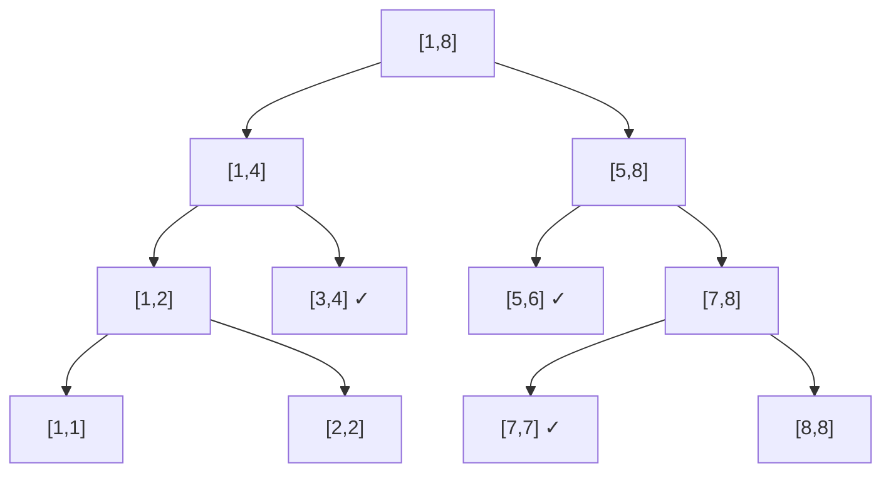
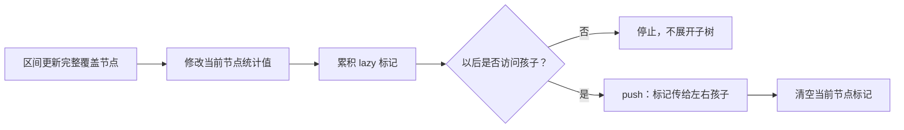

# 线段树

线段树把区间递归二分。每个节点保存一段区间的统计信息，父节点答案由左右孩子合并。只要信息能快速合并，就能在 $O(\log n)$ 内完成单点修改和区间查询。

本文完整推导“区间加、区间求和”的懒标记线段树，数组与区间都使用 1 下标闭区间。读者应先理解递归分治；其他节点信息或多重标记只有在回答完合并、作用与组合规则后才能套用。

## 从区间和开始

节点 `p` 管理 `[l,r]`：若 `l==r` 是叶子；否则左右孩子管理 `[l,mid]` 与 `[mid+1,r]`，并令 `sum[p]=sum[left]+sum[right]`。

下面以长度为 8 的数组为例。查询 `[3,7]` 时，不必访问五个叶子，而是拆成 `[3,4]`、`[5,6]`、`[7,7]` 三个完整节点；一次查询只会在每层经过常数个边界节点。



```cpp
struct SegmentTree {
    int n;
    vector<long long> sum, lazy;
    SegmentTree(const vector<long long>& a) {
        n = (int)a.size() - 1; // a 为 1-based
        sum.assign(4 * n + 4, 0);
        lazy.assign(4 * n + 4, 0);
        build(1, 1, n, a);
    }
    void build(int p, int l, int r, const vector<long long>& a) {
        if (l == r) { sum[p] = a[l]; return; }
        int m = (l + r) / 2;
        build(p * 2, l, m, a);
        build(p * 2 + 1, m + 1, r, a);
        sum[p] = sum[p * 2] + sum[p * 2 + 1];
    }
```

## 懒标记：区间增加

若更新区间完整覆盖当前节点，直接更新节点的和，并记录“它的所有元素都应增加 $v$”。只有将来需要访问孩子时，才把标记下传。



```cpp
    void apply(int p, int l, int r, long long v) {
        sum[p] += v * (r - l + 1);
        lazy[p] += v;
    }
    void push(int p, int l, int r) {
        if (lazy[p] == 0 || l == r) return;
        int m = (l + r) / 2;
        apply(p * 2, l, m, lazy[p]);
        apply(p * 2 + 1, m + 1, r, lazy[p]);
        lazy[p] = 0;
    }
    void rangeAdd(int p, int l, int r, int ql, int qr, long long v) {
        if (ql <= l && r <= qr) { apply(p, l, r, v); return; }
        push(p, l, r);
        int m = (l + r) / 2;
        if (ql <= m) rangeAdd(p * 2, l, m, ql, qr, v);
        if (qr > m) rangeAdd(p * 2 + 1, m + 1, r, ql, qr, v);
        sum[p] = sum[p * 2] + sum[p * 2 + 1];
    }
    long long query(int p, int l, int r, int ql, int qr) {
        if (ql <= l && r <= qr) return sum[p];
        push(p, l, r);
        int m = (l + r) / 2;
        long long ans = 0;
        if (ql <= m) ans += query(p * 2, l, m, ql, qr);
        if (qr > m) ans += query(p * 2 + 1, m + 1, r, ql, qr);
        return ans;
    }
};
```

### 手算例题

数组 `1 2 3 4`，对 `[2,4]` 加 5。根 `[1,4]` 只部分覆盖，于是递归；`[3,4]` 被完整覆盖，和从 7 变为 17 并记懒标记 5，无需立即修改两个叶子。查询 `[3,3]` 时再下传，叶子 3 的值变为 8。

建树 $O(n)$，每次区间更新/查询 $O(\log n)$，空间通常开 `4*n`。

## 维护不变量与复杂度

任意时刻，节点 `sum[p]` 都等于它管理区间在全部历史修改后的真实元素和；`lazy[p]` 表示已经计入 `sum[p]`、但尚未向孩子展开的整段增量。`apply` 同时修改二者，所以完整覆盖时不需要访问叶子；`push` 把同一影响传给两个孩子后清零父标记，保持不变量不变。

查询把目标区间分成若干个互不重叠的完整节点。递归在每层至多经过左右两个边界分支，中间完整覆盖的节点立即停止，因此访问节点数是 $O(\log n)$。区间更新具有相同的边界结构。这个结论依赖更新和查询都是连续区间，而不是任意位置集合。

## 设计线段树的四个问题

1. 节点信息是什么（和、最大值、最大子段和……）？
2. 两个孩子怎样合并？
3. 更新怎样作用于节点信息？
4. 多种懒标记怎样组合、先后顺序如何？

例如“区间赋值 + 区间增加”同时存在时，赋值会覆盖旧赋值和旧增加；下传顺序写错会得到错误答案。

## 真题：P3372 线段树 1

[洛谷 P3372【模板】线段树 1](https://www.luogu.com.cn/problem/P3372) 同时要求区间加和区间求和。节点和、区间长度以及懒标记的作用正好对应前文四个设计问题。

题目对象的映射为：一个线段树节点代表原数组的连续区间，`sum` 是需要查询的信息，`lazy` 是区间加在该信息上的延迟作用。区间和可能达到“元素值乘区间长度”的量级，所以节点值、标记和乘法必须统一使用 `long long`。

```cpp
#include <bits/stdc++.h>
using namespace std;

class SegmentTree {
    int n;
    vector<long long> sum, lazy;

    void build(int node, int left, int right, const vector<long long>& a) {
        if (left == right) { sum[node] = a[left]; return; }
        int middle = (left + right) / 2;
        build(node * 2, left, middle, a);
        build(node * 2 + 1, middle + 1, right, a);
        sum[node] = sum[node * 2] + sum[node * 2 + 1];
    }
    void apply(int node, int left, int right, long long delta) {
        sum[node] += delta * (right - left + 1);
        lazy[node] += delta;
    }
    void push(int node, int left, int right) {
        if (lazy[node] == 0 || left == right) return;
        int middle = (left + right) / 2;
        apply(node * 2, left, middle, lazy[node]);
        apply(node * 2 + 1, middle + 1, right, lazy[node]);
        lazy[node] = 0;
    }
    void rangeAdd(int node, int left, int right,
                  int queryLeft, int queryRight, long long delta) {
        if (queryLeft <= left && right <= queryRight) {
            apply(node, left, right, delta);
            return;
        }
        push(node, left, right);
        int middle = (left + right) / 2;
        if (queryLeft <= middle)
            rangeAdd(node * 2, left, middle, queryLeft, queryRight, delta);
        if (queryRight > middle)
            rangeAdd(node * 2 + 1, middle + 1, right,
                     queryLeft, queryRight, delta);
        sum[node] = sum[node * 2] + sum[node * 2 + 1];
    }
    long long rangeSum(int node, int left, int right,
                       int queryLeft, int queryRight) {
        if (queryLeft <= left && right <= queryRight) return sum[node];
        push(node, left, right);
        int middle = (left + right) / 2;
        long long answer = 0;
        if (queryLeft <= middle)
            answer += rangeSum(node * 2, left, middle, queryLeft, queryRight);
        if (queryRight > middle)
            answer += rangeSum(node * 2 + 1, middle + 1, right,
                               queryLeft, queryRight);
        return answer;
    }

public:
    explicit SegmentTree(const vector<long long>& a) {
        n = (int)a.size() - 1;
        sum.assign(4 * n + 4, 0);
        lazy.assign(4 * n + 4, 0);
        build(1, 1, n, a);
    }
    void add(int left, int right, long long delta) {
        rangeAdd(1, 1, n, left, right, delta);
    }
    long long query(int left, int right) {
        return rangeSum(1, 1, n, left, right);
    }
};

int main() {
    ios::sync_with_stdio(false);
    cin.tie(nullptr);

    int n, operations;
    cin >> n >> operations;
    vector<long long> a(n + 1);
    for (int i = 1; i <= n; ++i) cin >> a[i];
    SegmentTree segmentTree(a);

    while (operations--) {
        int type, left, right;
        cin >> type >> left >> right;
        if (type == 1) {
            long long delta;
            cin >> delta;
            segmentTree.add(left, right, delta);
        } else {
            cout << segmentTree.query(left, right) << '\n';
        }
    }
    return 0;
}
```

建树 $O(n)$，每次操作 $O(\log n)$，空间 $O(n)$。题目允许区间和很大，节点和与懒标记都必须使用 `long long`。

## 易错点

- 完整覆盖与部分覆盖条件写反。
- 更新节点和时忘记乘区间长度。
- 查询或递归孩子前忘记 `push`。
- 把 0 当作“没有赋值标记”，但合法操作可能正是赋值为 0；应另设布尔标志。
- `sum` 和 `lazy` 使用 `int` 导致溢出。
