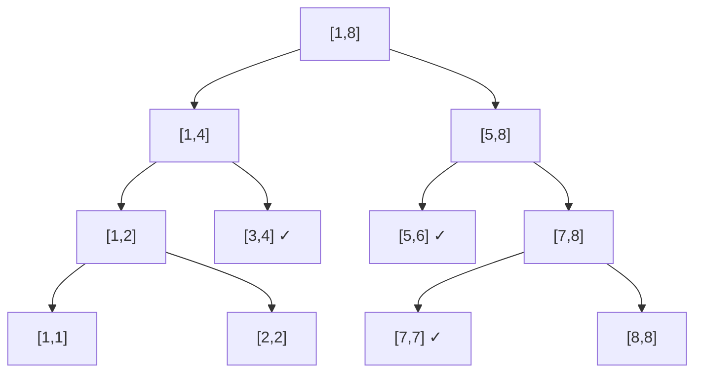
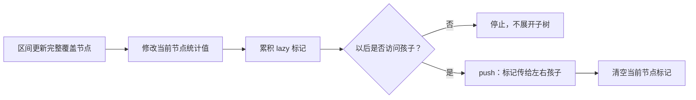

# 线段树

线段树把区间递归二分。每个节点保存一段区间的统计信息，父节点答案由左右孩子合并。只要信息能快速合并，就能在 $O(\log n)$ 内完成单点修改和区间查询。

## 从区间和开始

节点 `p` 管理 `[l,r]`：若 `l==r` 是叶子；否则左右孩子管理 `[l,mid]` 与 `[mid+1,r]`，并令 `sum[p]=sum[left]+sum[right]`。

下面以长度为 8 的数组为例。查询 `[3,7]` 时，不必访问五个叶子，而是拆成 `[3,4]`、`[5,6]`、`[7,7]` 三个完整节点；一次查询只会在每层经过常数个边界节点。



```cpp
struct SegmentTree {
    int n;
    vector<long long> sum, lazy;
    SegmentTree(const vector<long long>& a) {
        n = (int)a.size() - 1; // a 为 1-based
        sum.assign(4 * n + 4, 0);
        lazy.assign(4 * n + 4, 0);
        build(1, 1, n, a);
    }
    void build(int p, int l, int r, const vector<long long>& a) {
        if (l == r) { sum[p] = a[l]; return; }
        int m = (l + r) / 2;
        build(p * 2, l, m, a);
        build(p * 2 + 1, m + 1, r, a);
        sum[p] = sum[p * 2] + sum[p * 2 + 1];
    }
```

## 懒标记：区间增加

若更新区间完整覆盖当前节点，直接更新节点的和，并记录“它的所有元素都应增加 $v$”。只有将来需要访问孩子时，才把标记下传。



```cpp
    void apply(int p, int l, int r, long long v) {
        sum[p] += v * (r - l + 1);
        lazy[p] += v;
    }
    void push(int p, int l, int r) {
        if (lazy[p] == 0 || l == r) return;
        int m = (l + r) / 2;
        apply(p * 2, l, m, lazy[p]);
        apply(p * 2 + 1, m + 1, r, lazy[p]);
        lazy[p] = 0;
    }
    void rangeAdd(int p, int l, int r, int ql, int qr, long long v) {
        if (ql <= l && r <= qr) { apply(p, l, r, v); return; }
        push(p, l, r);
        int m = (l + r) / 2;
        if (ql <= m) rangeAdd(p * 2, l, m, ql, qr, v);
        if (qr > m) rangeAdd(p * 2 + 1, m + 1, r, ql, qr, v);
        sum[p] = sum[p * 2] + sum[p * 2 + 1];
    }
    long long query(int p, int l, int r, int ql, int qr) {
        if (ql <= l && r <= qr) return sum[p];
        push(p, l, r);
        int m = (l + r) / 2;
        long long ans = 0;
        if (ql <= m) ans += query(p * 2, l, m, ql, qr);
        if (qr > m) ans += query(p * 2 + 1, m + 1, r, ql, qr);
        return ans;
    }
};
```

### 手算例题

数组 `1 2 3 4`，对 `[2,4]` 加 5。根 `[1,4]` 只部分覆盖，于是递归；`[3,4]` 被完整覆盖，和从 7 变为 17 并记懒标记 5，无需立即修改两个叶子。查询 `[3,3]` 时再下传，叶子 3 的值变为 8。

建树 $O(n)$，每次区间更新/查询 $O(\log n)$，空间通常开 `4*n`。

## 设计线段树的四个问题

1. 节点信息是什么（和、最大值、最大子段和……）？
2. 两个孩子怎样合并？
3. 更新怎样作用于节点信息？
4. 多种懒标记怎样组合、先后顺序如何？

例如“区间赋值 + 区间增加”同时存在时，赋值会覆盖旧赋值和旧增加；下传顺序写错会得到错误答案。

## 易错点

- 完整覆盖与部分覆盖条件写反。
- 更新节点和时忘记乘区间长度。
- 查询或递归孩子前忘记 `push`。
- 把 0 当作“没有赋值标记”，但合法操作可能正是赋值为 0；应另设布尔标志。
- `sum` 和 `lazy` 使用 `int` 导致溢出。
