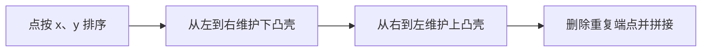

# 二维凸包

!!! info "考纲定位"
    凸包通常属于 NOI 级计算几何拓展。学习前应先掌握向量、叉积与浮点比较。

给定平面点集，凸包是包含所有点的最小凸多边形。直观上，可以把点看作钉子，用橡皮筋围住它们；橡皮筋接触到的外层点组成凸包。

## 为什么只需要维护转向

若按横坐标、再按纵坐标排序，从最左点走向最右点构造下凸壳。路径上的每次转向都应保持逆时针；若新点让最后三点变成顺时针或不需要保留的共线，就说明中间点落在当前外壳内，应删除。

对栈末尾两点 $A,B$ 和新点 $C$，检查：

$$
(B-A)\times(C-B).
$$

- 正数：逆时针转向，保留 $B$；
- 负数：顺时针，$B$ 不可能在下凸壳上；
- 零：三点共线，是否保留中间点取决于题目需求。

求最小顶点集合或周长时，通常弹出共线中间点，即条件使用 `<= 0`。

## Andrew 单调链算法

1. 将点排序并去重。
2. 从左到右构造下凸壳。
3. 从右到左构造上凸壳。
4. 两段都包含左右端点，拼接时去掉重复端点。



```cpp
struct Point {
    double x, y;
    bool operator<(const Point& other) const {
        if (x != other.x) return x < other.x;
        return y < other.y;
    }
    bool operator==(const Point& other) const {
        return x == other.x && y == other.y;
    }
};

Point operator-(Point a, Point b) {
    return {a.x - b.x, a.y - b.y};
}

double cross(Point a, Point b) {
    return a.x * b.y - a.y * b.x;
}

vector<Point> convexHull(vector<Point> points) {
    sort(points.begin(), points.end());
    points.erase(unique(points.begin(), points.end()), points.end());
    if (points.size() <= 1) return points;

    vector<Point> hull;
    for (Point point : points) {
        while (hull.size() >= 2 &&
               cross(hull.back() - hull[hull.size() - 2],
                     point - hull.back()) <= 0)
            hull.pop_back();
        hull.push_back(point);
    }

    size_t lowerSize = hull.size();
    for (int i = (int)points.size() - 2; i >= 0; --i) {
        Point point = points[i];
        while (hull.size() > lowerSize &&
               cross(hull.back() - hull[hull.size() - 2],
                     point - hull.back()) <= 0)
            hull.pop_back();
        hull.push_back(point);
    }
    hull.pop_back(); // 起点重复出现
    return hull;
}
```

## 正确性理解

构造下凸壳时，栈始终满足：

1. 点的横坐标顺序不减；
2. 相邻三点保持逆时针转向；
3. 已处理点都在当前折线的上方或折线上。

若 $A,B,C$ 不构成逆时针转向，连接 $A$ 到 $C$ 后，$B$ 位于线段内侧或只是共线中间点，不可能成为最小凸包的必要顶点，所以可以弹出。反复处理后得到所有点的下边界；对称地得到上边界，二者合成完整凸包。

排序耗时 $O(n\log n)$。每个点在上下凸壳中各入栈一次、出栈至多一次，扫描部分为 $O(n)$，总复杂度 $O(n\log n)$，空间 $O(n)$。

## 真题：P2742 圈奶牛

[洛谷 P2742【模板】二维凸包](https://www.luogu.com.cn/problem/P2742) 要求能包围所有给定点的最短围栏长度。这条围栏就是凸包边界，因此先求凸包，再累加相邻顶点欧氏距离。

```cpp
#include <bits/stdc++.h>
using namespace std;

const double EPS = 1e-10;

struct Point {
    double x, y;
    bool operator<(const Point& other) const {
        if (x != other.x) return x < other.x;
        return y < other.y;
    }
};

Point operator-(Point a, Point b) {
    return {a.x - b.x, a.y - b.y};
}

double cross(Point a, Point b) {
    return a.x * b.y - a.y * b.x;
}

double distance(Point a, Point b) {
    return hypot(a.x - b.x, a.y - b.y);
}

vector<Point> convexHull(vector<Point> points) {
    sort(points.begin(), points.end());
    vector<Point> uniquePoints;
    for (Point point : points) {
        if (uniquePoints.empty() || distance(uniquePoints.back(), point) > EPS)
            uniquePoints.push_back(point);
    }
    points.swap(uniquePoints);
    if (points.size() <= 1) return points;

    vector<Point> hull;
    for (Point point : points) {
        while (hull.size() >= 2 &&
               cross(hull.back() - hull[hull.size() - 2],
                     point - hull.back()) <= EPS)
            hull.pop_back();
        hull.push_back(point);
    }
    size_t lowerSize = hull.size();
    for (int i = (int)points.size() - 2; i >= 0; --i) {
        Point point = points[i];
        while (hull.size() > lowerSize &&
               cross(hull.back() - hull[hull.size() - 2],
                     point - hull.back()) <= EPS)
            hull.pop_back();
        hull.push_back(point);
    }
    hull.pop_back();
    return hull;
}

int main() {
    ios::sync_with_stdio(false);
    cin.tie(nullptr);

    int n;
    cin >> n;
    vector<Point> points(n);
    for (Point& point : points) cin >> point.x >> point.y;
    vector<Point> hull = convexHull(points);

    double perimeter = 0;
    for (int i = 0; i < (int)hull.size(); ++i)
        perimeter += distance(hull[i], hull[(i + 1) % hull.size()]);
    cout << fixed << setprecision(2) << perimeter << '\n';
    return 0;
}
```

## 共线点到底保不保留

- 只需要最外层拐点或周长：弹出共线中间点。
- 要求输出边界上的所有输入点：只弹出严格顺时针点，并额外处理全体共线情况。
- 后续旋转卡壳等算法：按后续算法约定决定，不能随意更换条件。

## 易错点

- 上凸壳起点和下凸壳终点重复计算。
- 排序前没有去重，同一点造成零向量与错误转向。
- `cross < 0` 与 `cross <= 0` 的选择和题目边界要求不一致。
- 使用浮点坐标却直接比较 `cross == 0`。
- 只累加相邻点距离，忘记最后一点回到第一点。
