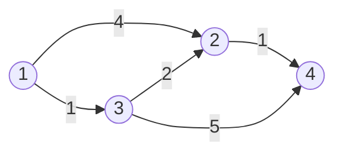

# 最短路

选择算法前先看边权：无权（或等权）用 BFS；只有 0/1 用 0-1 BFS；非负权用 Dijkstra；允许负权用 Bellman–Ford；点数较小且需任意两点距离用 Floyd–Warshall。

本文统一讨论从源点到其他点的最短路；除 Floyd–Warshall 外，`dist[v]` 表示当前已知的最小路径长度上界。算法之间的差别不是代码模板，而是在哪些前提下可以确认一个距离已最终确定，以及需要执行多少轮松弛。

## 松弛

若已知到 $u$ 的距离 `dist[u]`，经过边 $(u,v,w)$ 可尝试改进 $v$：

```cpp
if (dist[v] > dist[u] + w) dist[v] = dist[u] + w;
```

这一步叫松弛。所有最短路算法都在安排“以什么顺序、做多少次松弛”。

## Dijkstra：非负权

小根堆每次取当前距离最小的状态。因为边权非负，没有尚未处理的更远点能绕回来把它变得更小。

证明这个贪心时，设 $u$ 是当前未确定顶点中 `dist` 最小者。若存在更短路径，从源点沿该路径找到第一个未确定顶点 $x$，其前驱已经确定；该前驱被处理时会把真实候选距离松弛到 $x$。由于后续边权非负，`dist[x]` 不大于整条假设路径长度，又不小于当前最小的 `dist[u]`，与“到 $u$ 还有更短路径”矛盾。因此弹出的有效最小状态可以定型。

负边会破坏这一步。例如已知到 $u$ 的距离为 2，另一个尚未处理点距离为 5，但它可能通过权值 $-10$ 的边返回 $u$，把距离改成 $-5$；所以 Dijkstra 的非负权前提不能省略。

```cpp
const long long INF = (1LL << 62);
vector<long long> dijkstra(int s, const vector<vector<Edge>>& g) {
    int n = (int)g.size() - 1;
    vector<long long> dist(n + 1, INF);
    priority_queue<pair<long long,int>,
                   vector<pair<long long,int>>,
                   greater<pair<long long,int>>> pq;
    dist[s] = 0;
    pq.push({0, s});
    while (!pq.empty()) {
        auto [du, u] = pq.top(); pq.pop();
        if (du != dist[u]) continue; // 过期状态
        for (auto [v, w] : g[u]) {
            if (dist[v] > du + w) {
                dist[v] = du + w;
                pq.push({dist[v], v});
            }
        }
    }
    return dist;
}
```

复杂度 $O((n+m)\log n)$。只要存在负权边，上述“取出即安全”的证明就失效。

## Bellman–Ford 与负环

一条不重复顶点的最短路至多含 $n-1$ 条边。连续做 $n-1$ 轮，对所有边松弛，就能得到最短路；若第 $n$ 轮仍能松弛，则存在从源点可达的负环。

复杂度 $O(nm)$。SPFA 只把被更新的点放入队列，许多数据上更快，但最坏仍为 $O(nm)$，不能把它当作稳定的线性算法。

## Floyd–Warshall：多源最短路

令 `d[i][j]` 为当前最短距离。依次允许编号 $1..k$ 的点作为中间点：

```cpp
for (int k = 1; k <= n; ++k)
    for (int i = 1; i <= n; ++i)
        for (int j = 1; j <= n; ++j)
            if (d[i][k] < INF && d[k][j] < INF)
                d[i][j] = min(d[i][j], d[i][k] + d[k][j]);
```

循环顺序必须让 `k` 在最外层。时间 $O(n^3)$，空间 $O(n^2)$。若最终 `d[i][i]<0`，说明存在涉及 $i$ 的负环。

## 手算例题

边为 $1\to2(4),1\to3(1),3\to2(2),2\to4(1),3\to4(5)$。Dijkstra 先确定 3（距离 1），由 3 把 2 更新为 3、4 更新为 6；再确定 2，把 4 更新为 4。最短路为 `1-3-2-4`。



| 确定的点 | 新发生的有效松弛 | 当前 $d_2,d_3,d_4$ |
| --- | --- | --- |
| 1 | $d_2\leftarrow4, d_3\leftarrow1$ | $4,1,\infty$ |
| 3 | $d_2\leftarrow3, d_4\leftarrow6$ | $3,1,6$ |
| 2 | $d_4\leftarrow4$ | $3,1,4$ |
| 4 | 无 | $3,1,4$ |

图中 `1→2→4` 虽然边数更少，权值和却为 5；最短路比较的是总权值而不是经过的边数。

## 次短路

同时为每个点维护最短 `d1` 与严格次短 `d2`。新距离 `nd` 小于 `d1[v]` 时，旧最短顺延为次短；若 `d1[v] < nd < d2[v]`，更新次短。是否允许与最短等长、是否允许重复点/边必须以题意为准。

## 真题：P4779 单源最短路径

[洛谷 P4779【模板】单源最短路径（标准版）](https://www.luogu.com.cn/problem/P4779) 的边权均为非负数，图又较稀疏，因此使用邻接表加堆优化 Dijkstra。

题目保证的非负边权支撑“最小距离定型”证明；稀疏图使邻接表只遍历实际存在的 $m$ 条边。堆中可能同时存在同一点的旧距离，`currentDistance != distance[u]` 时跳过即可，无需在堆内删除旧键。

```cpp
#include <bits/stdc++.h>
using namespace std;

struct Edge { int to, weight; };

int main() {
    ios::sync_with_stdio(false);
    cin.tie(nullptr);

    int n, m, source;
    cin >> n >> m >> source;
    vector<vector<Edge>> graph(n + 1);
    while (m--) {
        int from, to, weight;
        cin >> from >> to >> weight;
        graph[from].push_back({to, weight});
    }

    const long long INF = (1LL << 62);
    vector<long long> distance(n + 1, INF);
    priority_queue<pair<long long,int>,
                   vector<pair<long long,int>>,
                   greater<pair<long long,int>>> heap;
    distance[source] = 0;
    heap.push({0, source});

    while (!heap.empty()) {
        auto [currentDistance, u] = heap.top();
        heap.pop();
        if (currentDistance != distance[u]) continue;
        for (Edge edge : graph[u]) {
            if (distance[edge.to] > currentDistance + edge.weight) {
                distance[edge.to] = currentDistance + edge.weight;
                heap.push({distance[edge.to], edge.to});
            }
        }
    }

    for (int vertex = 1; vertex <= n; ++vertex)
        cout << distance[vertex] << " \n"[vertex == n];
    return 0;
}
```

每次有效松弛插入一个堆状态；旧状态弹出时用距离判断并跳过。复杂度 $O((n+m)\log n)$，空间 $O(n+m)$。

## 易错点

- `INF + w` 溢出，松弛前先判断可达。
- Dijkstra 用在负权图。
- 无向图只加单向边。
- Floyd 初始化时没有令 `d[i][i]=0`，或重边没有取最小值。
- “最短路不存在”和“距离很大”输出规则混淆。
