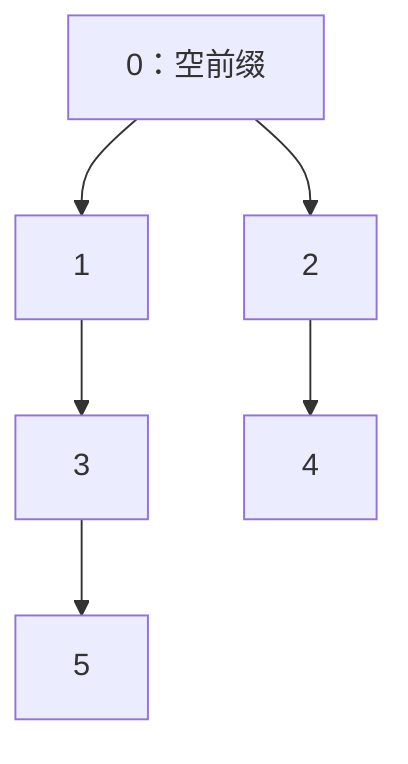

# Border、周期与失配树

KMP 不只是一个匹配模板。前缀函数 `pi[i]` 记录 `s[0..i]` 的最长 Border 长度；沿着 `pi` 不断回退，就能枚举一个前缀的所有 Border。这条回退链同时编码了字符串的周期结构。

阅读本页前应先掌握 [KMP](kmp.md) 中前缀函数的定义与构造。

## 1. 从最长 Border 得到全部 Border

令长度为 $n$ 的字符串最长 Border 长度为 $b=\pi[n-1]$。如果 $x$ 是原串的 Border，那么 $x$ 的 Border 也一定是原串的 Border。因此：

```text
b, pi[b-1], pi[pi[b-1]-1], ..., 0
```

恰好给出所有 Border 长度，且严格递减。

### 手算：`ababa`

`pi=[0,0,1,2,3]`。最长 Border 长度是 3，对应 `"aba"`；继续跳到 `pi[2]=1`，得到 `"a"`；再跳到 0 结束。因此全部非空 Border 是 `"aba"`、`"a"`。

```cpp
vector<int> allBorders(const string& s, const vector<int>& pi) {
    vector<int> lengths;
    for (int len = (int)s.size(); len > 0; len = pi[len - 1])
        lengths.push_back(len); // 包含原串长度；若只要真 Border，先从 pi[n-1] 开始
    reverse(lengths.begin(), lengths.end());
    return lengths;
}
```

每次长度严格减小，枚举时间不超过 $O(n)$。

## 2. 最小周期与最短循环节

设 $b=\pi[n-1]$。最长 Border 与原串重合了 $b$ 个字符，所以候选最小周期为：

$$
p=n-b.
$$

这里要区分两个问题：

- 求最小**周期**：答案总是 $n-\pi[n-1]$。
- 求能完整重复得到原串的最短**循环节**：还必须满足 $n\bmod p=0$；否则循环节长度是 $n$。

例如 `"abababa"` 的 `pi[6]=5`，最小周期为 2，因为向右平移 2 后重叠部分相同；但 $7$ 不能被 2 整除，所以它不能由 `"ab"` 完整重复得到。

## 3. 真实例题：洛谷 P4391「无线传输」

[题目链接](https://www.luogu.com.cn/problem/P4391)

题目给出的字符串是某个周期信号的一段连续片段，要求最短周期长度。这里不要求字符串由循环节完整重复，因此直接输出 $n-\pi[n-1]$。

```cpp
#include <bits/stdc++.h>
using namespace std;

int main() {
    ios::sync_with_stdio(false);
    cin.tie(nullptr);

    int n;
    string s;
    cin >> n >> s;

    vector<int> pi(n);
    for (int i = 1, j = 0; i < n; ++i) {
        while (j > 0 && s[i] != s[j]) j = pi[j - 1];
        if (s[i] == s[j]) ++j;
        pi[i] = j;
    }

    cout << n - pi[n - 1] << '\n';
    return 0;
}
```

构造 `pi` 为 $O(n)$，其余操作 $O(1)$，额外空间 $O(n)$。

## 4. 统计每个前缀的出现次数

设 `cnt[len]` 表示长度为 `len` 的前缀在整个字符串中出现多少次。每个位置 `i` 至少使前缀 `s[0..pi[i)-1]` 出现一次；更长 Border 的出现也会沿失配链贡献给更短 Border。

```cpp
vector<long long> prefixOccurrences(const string& s, const vector<int>& pi) {
    int n = s.size();
    vector<long long> cnt(n + 1);
    for (int i = 0; i < n; ++i) ++cnt[pi[i]];
    for (int len = n; len > 0; --len)
        cnt[pi[len - 1]] += cnt[len];
    for (int len = 0; len <= n; ++len) ++cnt[len]; // 前缀自身出现一次
    return cnt;
}
```

为什么要从长到短累加？长度 `len` 的前缀每出现一次，它的最长 Border `pi[len-1]` 也随之出现一次；后者再把贡献传给更短 Border。依赖方向正是从长前缀指向短前缀。

## 5. 失配树

把每个前缀长度看作节点，并连接父边：

$$
parent(len)=\pi[len-1],\qquad len\ge1.
$$

因为父节点编号严格更小，这些边形成一棵以 0 为根的树。节点 $u$ 是节点 $v$ 的祖先，当且仅当长度 $u$ 的前缀是长度 $v$ 前缀的 Border。



失配树让 Border 关系变成祖先关系：两个前缀的最长公共 Border 可以转成树上 LCA；一个前缀是多少更长前缀的 Border，可以转成子树统计。这属于 KMP 信息与树算法的结合，不必把复杂逻辑硬塞回求 `pi` 的循环。

## 常见错误

- 把“最小周期”和“最短整循环节”混为一谈，漏掉整除判断。
- 为满足题目额外限制而修改 `pi` 的定义；应先求标准前缀函数，再沿失配链筛选。
- 枚举 Border 时写成 `len=pi[len]`，产生错位或越界。
- 统计出现次数时从短到长传递，依赖顺序相反。
- 忘记给每个前缀自身的一次出现加 1。
