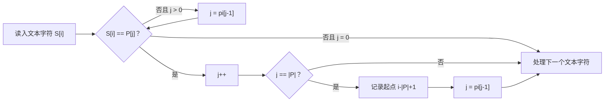

# KMP：失配后不回头

给定文本串 $S$ 和模式串 $P$，最直接的匹配方法是枚举每个起点，再逐字符比较。问题出在失配时：刚刚比较成功的字符全部被丢弃，下一个起点又从头比较。最坏情况下会做 $O(|S||P|)$ 次比较。

KMP 的目标不是避免失配，而是回答：**已经知道前 $j$ 个字符匹配时，失配后最多还能保留多少个已匹配字符？**

## 1. 一次失配暴露出的重复工作

令：

```text
文本 S = abababca
模式 P = ababca
```

从位置 0 开始，前四个字符 `abab` 匹配，接下来比较 `S[4]='a'` 与 `P[4]='c'` 时失配。

朴素算法会把模式串右移一位，再从 `P[0]` 开始。但已匹配片段 `abab` 的后缀 `ab`，恰好等于模式串的前缀 `ab`：

```text
已匹配文本：a b a b
模式串前缀：    a b
```

因此，文本指针不需要退回，模式串只要把“已匹配长度”从 4 改成 2，就能继续比较。KMP 保存的正是这种前后缀重合。

## 2. 前缀函数 `pi`

对模式串 $P$，定义：

$$
\pi[i]=\max\{k\mid 0\le k<i+1,\ P[0..k-1]=P[i-k+1..i]\}.
$$

也就是说，`pi[i]` 是前缀 `P[0..i]` 的最长相等真前缀与真后缀长度，也就是最长 Border 长度。

以 `P="ababca"` 为例：

| $i$ | 前缀 | 最长 Border | `pi[i]` |
| --- | --- | --- | --- |
| 0 | `a` | 空 | 0 |
| 1 | `ab` | 空 | 0 |
| 2 | `aba` | `a` | 1 |
| 3 | `abab` | `ab` | 2 |
| 4 | `ababc` | 空 | 0 |
| 5 | `ababca` | `a` | 1 |

所以 `pi=[0,0,1,2,0,1]`。

!!! note "`next` 与 `pi`"
    不同资料中的 `next` 可能保存长度、下标或特殊值 `-1`。本章统一使用 0-based 的前缀函数 `pi`：它永远表示长度。不要把不同定义的回退公式混用。

## 3. 怎样增量求 `pi`

假设 `pi[0..i-1]` 已知，现在求 `pi[i]`。先尝试把前一个前缀的最长 Border 延长一位：令 `j=pi[i-1]`，比较 `P[i]` 与 `P[j]`。

- 相等：原 Border 成功延长，`pi[i]=j+1`。
- 不等且 `j>0`：最长 Border 不能延长，但它的 Border 仍可能延长，于是令 `j=pi[j-1]`。
- 一直退到匹配成功或 `j=0`。

为什么下一候选恰好是 `pi[j-1]`？因为当前长度为 `j` 的前缀同时也是已处理部分的后缀；任何更短可行 Border 也必须是 `P[0..j-1]` 的 Border。`pi[j-1]` 是其中最长者，先尝试它不会漏解。

```cpp
vector<int> prefixFunction(const string& p) {
    int m = p.size();
    vector<int> pi(m);
    for (int i = 1, j = 0; i < m; ++i) {
        while (j > 0 && p[i] != p[j]) j = pi[j - 1];
        if (p[i] == p[j]) ++j;
        pi[i] = j;
    }
    return pi;
}
```

### 为什么构造是线性的

`j` 每次成功匹配最多增加 1，总增加量不超过 $m$；`while` 中每次回退都会严格减小 `j`，总减少量不可能超过先前的总增加量。因此虽然代码中有嵌套循环，所有回退次数之和仍为 $O(m)$。

## 4. 用模式串匹配文本

扫描文本时，`j` 表示：当前文本前缀的后缀中，与模式串前缀相等的最大长度。比较新字符 `S[i]`：

1. 若失配，沿 `pi` 链回退 `j`；文本位置 `i` 不后退。
2. 若 `S[i]==P[j]`，令 `j++`。
3. 若 `j==m`，找到一次匹配，起点为 `i-m+1`。
4. 记录后令 `j=pi[j-1]`，继续寻找可能重叠的匹配。



```cpp
vector<int> kmpSearch(const string& text, const string& pattern) {
    vector<int> positions;
    if (pattern.empty()) return positions;

    vector<int> pi = prefixFunction(pattern);
    for (int i = 0, j = 0; i < (int)text.size(); ++i) {
        while (j > 0 && text[i] != pattern[j]) j = pi[j - 1];
        if (text[i] == pattern[j]) ++j;
        if (j == (int)pattern.size()) {
            positions.push_back(i - (int)pattern.size() + 1);
            j = pi[j - 1];
        }
    }
    return positions;
}
```

每个文本字符使 `j` 至多增加一次；回退总次数同样受增加次数限制。匹配时间 $O(n)$，加上构造 `pi` 的 $O(m)$，总时间 $O(n+m)$，额外空间 $O(m)$。

## 5. 真实例题：洛谷 P3375「KMP 字符串匹配」

[题目链接](https://www.luogu.com.cn/problem/P3375)

题目要求输出模式串在文本串中的所有出现位置（1-based），再输出模式串的前缀函数。它直接检验三个容易遗漏的细节：匹配位置要转换下标；相邻答案可以重叠；匹配完成后仍要沿 `pi` 回退。

```cpp
#include <bits/stdc++.h>
using namespace std;

vector<int> prefixFunction(const string& s) {
    vector<int> pi(s.size());
    for (int i = 1, j = 0; i < (int)s.size(); ++i) {
        while (j > 0 && s[i] != s[j]) j = pi[j - 1];
        if (s[i] == s[j]) ++j;
        pi[i] = j;
    }
    return pi;
}

int main() {
    ios::sync_with_stdio(false);
    cin.tie(nullptr);

    string text, pattern;
    cin >> text >> pattern;
    vector<int> pi = prefixFunction(pattern);

    for (int i = 0, j = 0; i < (int)text.size(); ++i) {
        while (j > 0 && text[i] != pattern[j]) j = pi[j - 1];
        if (text[i] == pattern[j]) ++j;
        if (j == (int)pattern.size()) {
            cout << i - (int)pattern.size() + 2 << '\n'; // 转成 1-based
            j = pi[j - 1];
        }
    }

    for (int x : pi) cout << x << ' ';
    cout << '\n';
    return 0;
}
```

## 6. `pi` 比匹配结果多提供了什么

模式串出现位置只是 KMP 的一个用途。`pi` 还直接给出：

- 每个前缀的最长 Border；
- 沿失配链枚举全部 Border；
- 最小周期与循环节；
- 失配树上的祖先关系；
- KMP 自动机的状态回退。

这些应用统一放在 [Border、周期与失配树](border-period.md)，避免把基础匹配和所有扩展挤在同一页。

## 常见错误

- 把 `pi[i]` 理解成“下一次比较的位置”而不是长度，造成 `pi[j]` 与 `pi[j-1]` 混用。
- 构造 `pi` 或匹配时，失配只回退一次；候选可能连续失败，必须使用 `while`。
- 找到答案后把 `j` 清零，漏掉 `aaaaa` 中 `aaa` 的重叠出现。
- 模式串为空时仍访问 `pattern[0]`；竞赛题通常不含空串，但可复用函数应明确约定。
- 为满足某道题的 Border 长度限制而修改前缀函数构造。标准 `pi` 的正确性依赖它始终保存最长 Border；额外限制应在构造完成后处理。
