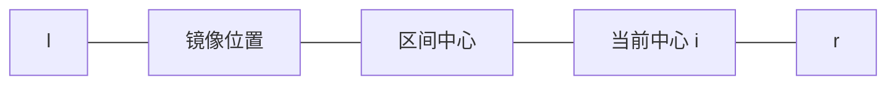

# Manacher 算法

Manacher（马拉车）算法在线性时间内求出以每个位置为中心的最长回文半径。它解决的关键问题是：中心扩展已经比较过的字符，能不能被后面的中心复用？

## 从中心扩展开始

判断一个位置附近的最长回文，最直接的方法是从中心向两边扩展：

- 奇回文以一个字符为中心，如 `abacaba`；
- 偶回文以两个字符之间为中心，如 `abba`。

单个中心最多扩展 $O(n)$，共有 $O(n)$ 个中心，最坏复杂度是 $O(n^2)$。例如所有字符都相同的字符串，每个中心都会反复比较大量相同字符。

Manacher 的改进思路是维护**当前右端点最靠右的回文区间**，利用其中的左右对称关系，给新中心一个已知的初始半径。

## 两套半径数组

这里不插入分隔符，分别处理奇、偶回文，能避免变换串和原串之间的下标换算。

### 奇回文数组 `d1`

`d1[i]` 表示以 `s[i]` 为中心的最长奇回文半径，**包含中心本身**：

$$
s[i-d1[i]+1\dots i+d1[i]-1].
$$

例如 `abacaba` 的中心字符 `c` 对应 `d1[3]=4`，回文长度为：

$$
2d1[3]-1=7.
$$

### 偶回文数组 `d2`

`d2[i]` 表示以 `s[i-1]` 和 `s[i]` 之间为中心的最长偶回文半径：

$$
s[i-d2[i]\dots i+d2[i]-1].
$$

例如 `abba` 中间的中心在 `i=2`，有 `d2[2]=2`，回文长度为 $2d2[2]=4$。

## 最右回文区间如何复用

维护闭区间 $[l,r]$，它是已经求出的、右端点最大的回文区间。

求奇回文中心 `i` 时：

- 若 `i > r`，没有已知信息，从半径 1 开始扩展；
- 若 `i <= r`，它关于区间中心的镜像位置是 `l+r-i`；
- 镜像半径可复用，但不能越过右边界，所以初值为

$$
d1[i]=\min(d1[l+r-i],\ r-i+1).
$$



初值覆盖的部分已经由对称性保证是回文。接下来只需从已知边界继续向外比较；若得到更靠右的回文，就更新 $[l,r]$。

偶回文完全同理，只是镜像下标与初始半径公式有一位差别。

## 完整模板

```cpp
// d1[i]：以 i 为中心的最长奇回文半径，包含中心
vector<int> manacherOdd(const string& s) {
    int n = s.size();
    vector<int> d1(n);
    for (int i = 0, l = 0, r = -1; i < n; ++i) {
        int k = (i > r) ? 1 : min(d1[l + r - i], r - i + 1);
        while (i - k >= 0 && i + k < n && s[i - k] == s[i + k])
            ++k;
        d1[i] = k;
        if (i + k - 1 > r) {
            l = i - k + 1;
            r = i + k - 1;
        }
    }
    return d1;
}

// d2[i]：以 i-1 与 i 之间为中心的最长偶回文半径
vector<int> manacherEven(const string& s) {
    int n = s.size();
    vector<int> d2(n);
    for (int i = 0, l = 0, r = -1; i < n; ++i) {
        int k = (i > r) ? 0 : min(d2[l + r - i + 1], r - i + 1);
        while (i - k - 1 >= 0 && i + k < n &&
               s[i - k - 1] == s[i + k])
            ++k;
        d2[i] = k;
        if (i + k - 1 > r) {
            l = i - k;
            r = i + k - 1;
        }
    }
    return d2;
}
```

## 为什么总复杂度是线性的

看起来每个中心仍有一个 `while`，但成功扩展只有两种情况：

1. 扩展发生在旧的 $r$ 以内：这部分由镜像初值直接跳过，不会逐字符重做；
2. 扩展超过旧的 $r$：每成功一次，最右端点 $r$ 至少右移一格。

$r$ 最多从 $-1$ 移到 $n-1$，因此所有成功扩展合计 $O(n)$；每个中心至多再有一次失败比较，所以总时间为 $O(n)$，空间为 $O(n)$。

## 例题：P3805【模板】manacher

[洛谷 P3805【模板】manacher](https://www.luogu.com.cn/problem/P3805)：求一个字符串的最长回文子串长度。

分别计算奇、偶半径：

- 奇回文长度为 $2d1[i]-1$；
- 偶回文长度为 $2d2[i]$。

取所有中心的最大值即可。

```cpp
#include <bits/stdc++.h>
using namespace std;

vector<int> manacherOdd(const string& s) {
    int n = s.size();
    vector<int> d1(n);
    for (int i = 0, l = 0, r = -1; i < n; ++i) {
        int k = (i > r) ? 1 : min(d1[l + r - i], r - i + 1);
        while (i - k >= 0 && i + k < n && s[i - k] == s[i + k]) ++k;
        d1[i] = k;
        if (i + k - 1 > r) l = i - k + 1, r = i + k - 1;
    }
    return d1;
}

vector<int> manacherEven(const string& s) {
    int n = s.size();
    vector<int> d2(n);
    for (int i = 0, l = 0, r = -1; i < n; ++i) {
        int k = (i > r) ? 0 : min(d2[l + r - i + 1], r - i + 1);
        while (i - k - 1 >= 0 && i + k < n && s[i - k - 1] == s[i + k]) ++k;
        d2[i] = k;
        if (i + k - 1 > r) l = i - k, r = i + k - 1;
    }
    return d2;
}

int main() {
    ios::sync_with_stdio(false);
    cin.tie(nullptr);

    string s;
    cin >> s;
    vector<int> d1 = manacherOdd(s);
    vector<int> d2 = manacherEven(s);

    int answer = 0;
    for (int x : d1) answer = max(answer, 2 * x - 1);
    for (int x : d2) answer = max(answer, 2 * x);
    cout << answer << '\n';
    return 0;
}
```

## 进一步应用

### 统计回文子串个数

固定中心时，每缩短一层仍然是回文。因此：

- 奇中心 `i` 贡献 `d1[i]` 个回文子串；
- 偶中心 `i` 贡献 `d2[i]` 个回文子串。

答案为：

$$
\sum_i d1[i]+\sum_i d2[i].
$$

这里相同内容出现在不同位置会分别计数；若要求不同回文串的数量，需要额外的数据结构。

### 判断一个区间是否为回文

对区间 `[l,r]`：

- 长度为奇数时，中心是 `(l+r)/2`，检查对应 `d1` 是否覆盖区间；
- 长度为偶数时，中心右侧下标是 `(l+r+1)/2`，检查对应 `d2`。

预处理后每次判断为 $O(1)$，而且没有哈希碰撞。

## 易错点

- 混淆半径与长度：奇回文长度是 `2*d1[i]-1`，偶回文长度是 `2*d2[i]`。
- `d1` 的半径包含中心，`d2` 的半径可以为 0。
- 一会儿把 $r$ 当闭区间端点，一会儿又当开边界。
- 偶回文镜像位置照搬奇回文公式，漏掉 `+1`。
- 只计算奇回文，因而漏掉 `abba` 一类答案。

## 小结

Manacher 的核心并不是难记的下标，而是一个和 Z 函数相似的思想：维护最靠右的已知匹配区间，先复用区间内部的信息，只对新区间以外的字符做比较。明确 `d1`、`d2` 的含义后，转移式和复杂度证明都会自然许多。
