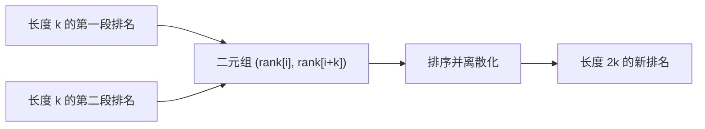

# 后缀数组

!!! info "考纲定位"
    后缀数组及其 LCP 通常属于 NOI 级进阶内容，不是 NOIP/CSP-S 的核心必修模板。建议先掌握排序、字符串哈希和倍增思想。

后缀数组把一个字符串的所有后缀按字典序排列。完成这次排序后，许多“任意两段如何比较”“有多少不同子串”的问题都会转化成相邻排名或区间查询。

## 三个数组

设字符串长度为 $n$，下标从 0 开始。

### `sa`：排名对应哪个后缀

`sa[k]` 表示字典序第 $k$ 小的后缀起点。

### `rank`：某个后缀排第几

`rank[i]` 表示后缀 `s[i..n-1]` 的排名，它与 `sa` 互为逆排列：

$$
rank[sa[k]]=k.
$$

### `height`：相邻后缀的 LCP

`height[k]` 表示排名为 $k-1$ 和 $k$ 的两个后缀的最长公共前缀：

$$
height[k]=\operatorname{LCP}(s[sa[k-1]\dots],s[sa[k]\dots]),
$$

并约定 `height[0]=0`。

## 例子：`banana`

先直接列出所有后缀：

| 起点 | 后缀 | 排名 |
| ---: | --- | ---: |
| 0 | `banana` | 3 |
| 1 | `anana` | 2 |
| 2 | `nana` | 5 |
| 3 | `ana` | 1 |
| 4 | `na` | 4 |
| 5 | `a` | 0 |

因此：

```text
sa     = [5, 3, 1, 0, 4, 2]
rank   = [3, 2, 5, 1, 4, 0]
height = [0, 1, 3, 0, 0, 2]
```

例如排名 1、2 的后缀是 `ana`、`anana`，最长公共前缀为 `ana`，所以 `height[2]=3`。

## 为什么不能直接排序后缀

把每个后缀交给普通字符串排序：

- 有 $n$ 个后缀；
- 一次比较最坏扫描 $O(n)$ 个字符；
- 排序需要 $O(n\log n)$ 次比较。

总复杂度最坏达到 $O(n^2\log n)$，而且若真的复制所有后缀，空间也可能是 $O(n^2)$。

后缀数组的倍增算法只保存每个后缀的整数排名。

## 倍增：从长度 $k$ 排到长度 $2k$

假设已经知道每个后缀前 $k$ 个字符的排名。要比较前 $2k$ 个字符，只需比较两个整数对：

$$
(rank[i],\ rank[i+k]).
$$

第一项代表前半段 `s[i..i+k-1]`，第二项代表后半段 `s[i+k..i+2k-1]`；越界的第二项视为 $-1$。



初始时 $k=1$，排名就是单个字符的大小。每轮令 $k$ 翻倍，经过 $O(\log n)$ 轮即可覆盖整个后缀。

若二元组用比较排序，每轮 $O(n\log n)$，总计 $O(n\log^2 n)$。模板使用计数排序：第二关键字的顺序可从上一轮 `sa` 推出，再按第一关键字计数排序，因此每轮 $O(n)$，总复杂度 $O(n\log n)$。

## 后缀数组模板

```cpp
vector<int> buildSuffixArray(const string& s) {
    int n = s.size();
    if (n == 0) return {};

    int alphabet = 256;
    vector<int> sa(n), rank(n), second(n);
    vector<int> count(max(n, alphabet), 0);

    // 先按单个字符排序
    for (unsigned char ch : s) ++count[ch];
    for (int i = 1; i < alphabet; ++i) count[i] += count[i - 1];
    for (int i = n - 1; i >= 0; --i)
        sa[--count[(unsigned char)s[i]]] = i;

    int classes = 1;
    rank[sa[0]] = 0;
    for (int i = 1; i < n; ++i) {
        if (s[sa[i]] != s[sa[i - 1]]) ++classes;
        rank[sa[i]] = classes - 1;
    }

    for (int k = 1; classes < n; k <<= 1) {
        int p = 0;

        // 第二关键字为空的后缀最小
        for (int i = n - k; i < n; ++i) second[p++] = i;
        // 其余后缀按上一轮 sa 的第二关键字顺序加入
        for (int i = 0; i < n; ++i)
            if (sa[i] >= k) second[p++] = sa[i] - k;

        fill(count.begin(), count.begin() + classes, 0);
        for (int i = 0; i < n; ++i) ++count[rank[second[i]]];
        for (int i = 1; i < classes; ++i) count[i] += count[i - 1];
        for (int i = n - 1; i >= 0; --i)
            sa[--count[rank[second[i]]]] = second[i];

        // second 暂存旧排名，rank 写入新排名
        swap(rank, second);
        rank[sa[0]] = 0;
        int newClasses = 1;
        for (int i = 1; i < n; ++i) {
            int a = sa[i - 1], b = sa[i];
            int a2 = (a + k < n) ? second[a + k] : -1;
            int b2 = (b + k < n) ? second[b + k] : -1;
            if (second[a] != second[b] || a2 != b2) ++newClasses;
            rank[b] = newClasses - 1;
        }
        classes = newClasses;
    }

    return sa;
}
```

### 为什么 `second` 的构造已经按第二关键字有序

一个后缀 `i` 的第二关键字是旧的 `rank[i+k]`。

1. `i+k` 越界的后缀第二关键字为 $-1$，应最先放入；它们的起点是 `n-k` 到 `n-1`。
2. 其余起点满足 `i = sa[j]-k`。按旧 `sa` 的顺序枚举 `sa[j]`，就等于按 `rank[i+k]` 从小到大枚举。

此时再进行一次稳定的第一关键字计数排序，就得到二元组的完整顺序。

## 例题：P3809【模板】后缀排序

[洛谷 P3809【模板】后缀排序](https://www.luogu.com.cn/problem/P3809)：输出所有后缀按字典序排序后的起始位置，题目使用 1-based 下标。

```cpp
#include <bits/stdc++.h>
using namespace std;

vector<int> buildSuffixArray(const string& s) {
    int n = s.size();
    if (n == 0) return {};
    const int ALPHABET = 256;
    vector<int> sa(n), rank(n), second(n);
    vector<int> count(max(n, ALPHABET), 0);

    for (unsigned char ch : s) ++count[ch];
    for (int i = 1; i < ALPHABET; ++i) count[i] += count[i - 1];
    for (int i = n - 1; i >= 0; --i)
        sa[--count[(unsigned char)s[i]]] = i;

    int classes = 1;
    rank[sa[0]] = 0;
    for (int i = 1; i < n; ++i) {
        if (s[sa[i]] != s[sa[i - 1]]) ++classes;
        rank[sa[i]] = classes - 1;
    }

    for (int k = 1; classes < n; k <<= 1) {
        int p = 0;
        for (int i = n - k; i < n; ++i) second[p++] = i;
        for (int i = 0; i < n; ++i)
            if (sa[i] >= k) second[p++] = sa[i] - k;

        fill(count.begin(), count.begin() + classes, 0);
        for (int i = 0; i < n; ++i) ++count[rank[second[i]]];
        for (int i = 1; i < classes; ++i) count[i] += count[i - 1];
        for (int i = n - 1; i >= 0; --i)
            sa[--count[rank[second[i]]]] = second[i];

        swap(rank, second);
        rank[sa[0]] = 0;
        int newClasses = 1;
        for (int i = 1; i < n; ++i) {
            int a = sa[i - 1], b = sa[i];
            int a2 = (a + k < n) ? second[a + k] : -1;
            int b2 = (b + k < n) ? second[b + k] : -1;
            if (second[a] != second[b] || a2 != b2) ++newClasses;
            rank[b] = newClasses - 1;
        }
        classes = newClasses;
    }
    return sa;
}

int main() {
    ios::sync_with_stdio(false);
    cin.tie(nullptr);

    string s;
    cin >> s;
    vector<int> sa = buildSuffixArray(s);
    for (int position : sa) cout << position + 1 << ' ';
    cout << '\n';
    return 0;
}
```

## Kasai 算法求 `height`

已经有 `sa` 后，朴素计算每对相邻后缀的 LCP 仍可能达到 $O(n^2)$。Kasai 算法利用一个关键性质：

> 若后缀 `i` 与它排名前一位的后缀有长度 $h$ 的公共前缀，那么删去首字符后，后缀 `i+1` 至少可以从 $h-1$ 开始尝试。

```cpp
vector<int> buildLcp(const string& s, const vector<int>& sa) {
    int n = s.size();
    vector<int> rank(n), height(n);
    for (int i = 0; i < n; ++i) rank[sa[i]] = i;

    for (int i = 0, matched = 0; i < n; ++i) {
        if (rank[i] == 0) {
            matched = 0;
            continue;
        }
        int j = sa[rank[i] - 1];
        while (i + matched < n && j + matched < n &&
               s[i + matched] == s[j + matched])
            ++matched;
        height[rank[i]] = matched;
        if (matched > 0) --matched;
    }
    return height;
}
```

`matched` 每轮最多减 1，而每次成功比较最多让它加 1，因此总时间是 $O(n)$。

## 应用：不同子串数量

长度为 $n$ 的字符串共有 $n(n+1)/2$ 个按位置计数的子串。按后缀数组顺序加入第 $k$ 个后缀时，它与前一个后缀有 `height[k]` 个前缀重复，所以新增的不同子串数为：

$$
n-sa[k]-height[k].
$$

于是不同子串总数为：

$$
\frac{n(n+1)}2-\sum_{k=1}^{n-1}height[k].
$$

可用 [洛谷 P2408 不同子串个数](https://www.luogu.com.cn/problem/P2408) 练习这一结论。答案可能达到 $O(n^2)$，应使用 `long long`。

## 易错点

- 混淆 `sa[k]` 和 `rank[i]`：前者由排名找位置，后者由位置找排名。
- 倍增时越界的第二关键字没有视为 $-1$。
- 新旧排名数组交换后，比较二元组时读错数组。
- 题目输出 1-based，内部实现却是 0-based，忘记加 1。
- `height[k]` 对应排名 `k-1` 与 `k`，不是后缀起点 `k-1` 与 `k`。
- 不同子串数量使用 `int` 导致溢出。

## 小结

后缀数组的主线可以概括为：

1. 用倍增把长串比较变成两个旧排名的比较；
2. 用计数排序把每轮降到线性；
3. 用 Kasai 在线性时间补出相邻后缀 LCP。

真正做综合题时，`sa` 负责字典序，`height` 负责相似程度；二者结合后，还可进一步接 RMQ、单调栈或并查集。
