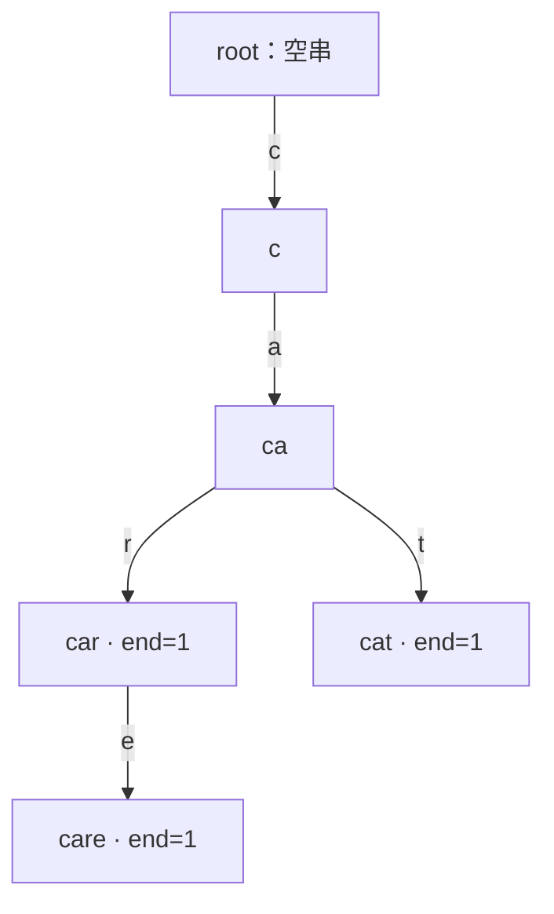

# Trie：把公共前缀合并起来

若字典中有 `car`、`cat`、`care`，逐个保存会重复记录前缀 `ca`。Trie（字典树）把相同前缀合并为同一个节点：从根走到某节点所经过的字符，唯一对应一个前缀。

这使得一次插入或查询只沿字符串走一遍，复杂度取决于字符串长度，而不是字典中字符串数量。

## 1. 节点究竟表示什么

根节点表示空串。若从根沿边 `c→a→r` 到达节点 $u$，则节点 $u$ 表示前缀 `"car"`。



常见统计量：

- `endCount[u]`：有多少个插入字符串恰好在节点 $u$ 结束。
- `passCount[u]`：有多少个插入字符串经过节点 $u$，即有多少字符串以该节点对应串为前缀。

路径存在只说明前缀存在，不能说明它是完整单词。例如插入 `care` 后路径 `car` 存在，但若 `endCount[car]==0`，字典中并没有单词 `car`。

## 2. 插入、精确查询与前缀统计

字符集只有小写字母时，每个节点可用长度 26 的数组保存儿子编号。不存在的儿子记为 0，根节点也使用编号 0，因此新节点从编号 1 开始。

```cpp
struct Trie {
    static constexpr int SIGMA = 26;
    vector<array<int, SIGMA>> next;
    vector<int> passCount, endCount;

    Trie() : next(1), passCount(1), endCount(1) {}

    int newNode() {
        next.push_back({});
        passCount.push_back(0);
        endCount.push_back(0);
        return (int)next.size() - 1;
    }

    void insert(const string& s) {
        int u = 0;
        ++passCount[u];
        for (char ch : s) {
            int c = ch - 'a';
            if (next[u][c] == 0) next[u][c] = newNode();
            u = next[u][c];
            ++passCount[u];
        }
        ++endCount[u];
    }

    int countWord(const string& s) const {
        int u = 0;
        for (char ch : s) {
            int c = ch - 'a';
            if (next[u][c] == 0) return 0;
            u = next[u][c];
        }
        return endCount[u];
    }

    int countWithPrefix(const string& prefix) const {
        int u = 0;
        for (char ch : prefix) {
            int c = ch - 'a';
            if (next[u][c] == 0) return 0;
            u = next[u][c];
        }
        return passCount[u];
    }
};
```

设操作字符串长度为 $L$。插入、精确查询、前缀计数均为 $O(L)$。数组 Trie 每个节点预留 $|\Sigma|$ 条边，空间为 $O(nodes\cdot|\Sigma|)$；若字符集很大且转移稀疏，可改用 `map` 或 `unordered_map`，用时间常数换空间。

## 3. 删除为什么要先确认存在

竞赛中通常采用惰性删除：保留节点，只把路径上的 `passCount` 和终点的 `endCount` 减一。若字符串不存在却直接减计数，会产生负数并破坏所有后续答案。

```cpp
bool erase(Trie& trie, const string& s) {
    if (trie.countWord(s) == 0) return false;

    int u = 0;
    --trie.passCount[u];
    for (char ch : s) {
        u = trie.next[u][ch - 'a'];
        --trie.passCount[u];
    }
    --trie.endCount[u];
    return true;
}
```

惰性删除不回收节点，适合操作总长度可控的竞赛题。真正回收节点还要维护引用关系或空闲节点池，除非内存限制迫使这样做，否则收益不大。

## 4. 真实例题：洛谷 P8306「字典树」

[题目链接](https://www.luogu.com.cn/problem/P8306)

先插入若干模式串。每次询问给出文本串 $t$，求有多少个模式串是 $t$ 的前缀，重复插入要重复计数。

若字典为 `a, ab, ab, abc`：

- 查询 `abcd`：沿路径依次经过 `a`、`ab`、`abc`，累加终点计数 $1+2+1=4$。
- 查询 `ax`：只经过完整单词 `a`，答案为 1；下一条边不存在即可停止。

这里不能返回最后节点的 `passCount`：它回答的是“多少字典串以查询串为前缀”，方向正好相反。正确做法是沿询问路径累加每个节点的 `endCount`。

题目字符集包含数字和大小写字母，先建立 62 个字符的映射：

```cpp
#include <bits/stdc++.h>
using namespace std;

int charId(char ch) {
    if ('a' <= ch && ch <= 'z') return ch - 'a';
    if ('A' <= ch && ch <= 'Z') return ch - 'A' + 26;
    return ch - '0' + 52;
}

struct PrefixTrie {
    static constexpr int SIGMA = 62;
    vector<array<int, SIGMA>> next{1};
    vector<int> endCount{0};

    int newNode() {
        next.push_back({});
        endCount.push_back(0);
        return (int)next.size() - 1;
    }

    void insert(const string& s) {
        int u = 0;
        for (char ch : s) {
            int c = charId(ch);
            if (next[u][c] == 0) next[u][c] = newNode();
            u = next[u][c];
        }
        ++endCount[u];
    }

    int countDictionaryPrefixes(const string& text) const {
        int u = 0, answer = 0;
        for (char ch : text) {
            int c = charId(ch);
            if (next[u][c] == 0) break;
            u = next[u][c];
            answer += endCount[u];
        }
        return answer;
    }
};

int main() {
    ios::sync_with_stdio(false);
    cin.tie(nullptr);

    int testCases;
    cin >> testCases;
    while (testCases--) {
        int n, q;
        cin >> n >> q;
        PrefixTrie trie;

        while (n--) {
            string s;
            cin >> s;
            trie.insert(s);
        }
        while (q--) {
            string text;
            cin >> text;
            cout << trie.countDictionaryPrefixes(text) << '\n';
        }
    }
    return 0;
}
```

设所有插入与询问字符串的总长度为 $M$，总时间 $O(M)$；节点数不超过所有插入字符串总长度加一。

## 5. 什么时候不用 Trie

- 只做完整字符串判重，不问前缀：哈希表通常更省空间。
- 只匹配一个模式串：KMP 更直接。
- 字符集极大、公共前缀很少：数组 Trie 会浪费大量空转移，应改稀疏存储。
- 需要同时匹配很多模式串在文本中的出现：Trie 是基础骨架，但还需失配边，进一步形成 AC 自动机（NOI 级拓展）。

## 常见错误

- 只看路径是否存在，忘记检查 `endCount`。
- 重复插入字符串却只用布尔终止标记，丢失出现次数。
- 把“字典串是询问串前缀”和“询问串是字典串前缀”两个方向写反。
- 多组数据没有清空节点，内存和计数串到下一组。
- 字符映射与题目字符集不一致，造成数组越界。
- 删除不存在的字符串，使路径计数变成负数。
