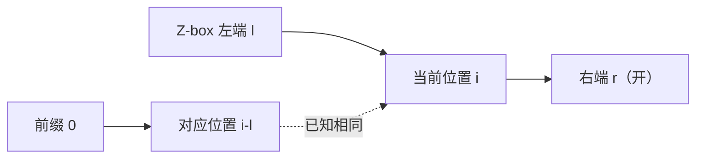

# Z 函数（扩展 KMP）

!!! info "考纲定位"
    Z 函数通常属于 NOI 级字符串拓展，不是 NOIP/CSP-S 的核心必修模板。本页放在独立文章中，适合掌握 KMP 后继续学习。

Z 函数回答这样一个问题：**从字符串的每个位置开始，能和整个字符串的前缀匹配多长？**

它和 KMP 都在复用已经比较过的信息，但方向不同：

- KMP 的前缀函数研究每个前缀的 Border；
- Z 函数直接研究“后缀与整个字符串前缀的 LCP”。

## 定义

对 0-based 字符串 $s$，定义：

$$
z[i]=\operatorname{LCP}(s, s[i\dots n-1]).
$$

也就是说，`z[i]` 是从 `i` 开始的后缀与原串的最长公共前缀长度。通常约定 `z[0]=n`；有些资料写成 0，做题前要确认题目定义。

以 `s = "aabcaabxaaaz"` 为例：

| `i` | 后缀开头 | `z[i]` | 原因 |
| ---: | --- | ---: | --- |
| 0 | `aabcaab...` | 12 | 整串与自身相同 |
| 1 | `abcaab...` | 1 | 只有第一个 `a` 相同 |
| 4 | `aabxaa...` | 3 | 与前缀共同拥有 `aab` |
| 8 | `aaaz` | 2 | 与前缀共同拥有 `aa` |
| 9 | `aaz` | 2 | 与前缀共同拥有 `aa` |

完整数组为：

```text
z = [12, 1, 0, 0, 3, 1, 0, 0, 2, 2, 1, 0]
```

## 朴素做法为什么会慢

对每个 `i` 都从 `s[0]` 开始逐字符比较，最坏是 $O(n^2)$。例如所有字符相同，位置 `i` 会比较 $n-i$ 次。

和 Manacher 一样，我们应记住当前**右端点最远的已知匹配区间**。

## Z-box

维护半开区间 $[l,r)$，满足：

$$
s[l\dots r-1]=s[0\dots r-l-1],
$$

并且它的右端点 $r$ 在已处理区间中最靠右。这个区间常称为 Z-box。

处理位置 `i` 时分两种情况。

### 情况一：`i >= r`

`i` 不在已知区间内，无法复用信息，只能从 0 开始向右匹配。

### 情况二：`i < r`

因为 $[l,r)$ 与前缀相等，位置 `i` 对应到前缀中的 `i-l`。因此可先取：

$$
z[i]=\min(z[i-l],\ r-i).
$$

- 若 `z[i-l] < r-i`，镜像匹配在边界内就已经失败，答案可以直接确定；
- 若 `z[i-l] >= r-i`，只能确定到 `r-1`，还要从 `r` 继续尝试扩展。



## 线性模板

```cpp
vector<int> zFunction(const string& s) {
    int n = s.size();
    vector<int> z(n);
    if (n == 0) return z;

    z[0] = n;
    for (int i = 1, l = 0, r = 0; i < n; ++i) {
        if (i < r) z[i] = min(r - i, z[i - l]);
        while (i + z[i] < n && s[z[i]] == s[i + z[i]])
            ++z[i];
        if (i + z[i] > r) {
            l = i;
            r = i + z[i];
        }
    }
    return z;
}
```

## 为什么是 $O(n)$

初值复制是 $O(1)$。`while` 中真正成功的比较若越过旧边界，就会让全局最右端点 `r` 向右移动；`r` 总共只会移动 $O(n)$ 次。每个位置至多还有一次失败比较，所以总时间 $O(n)$，空间 $O(n)$。

注意：不是每个 `while` 都是 $O(1)$，而是把所有循环放在一起分析后为 $O(n)$。

## 用 Z 函数做模式匹配

要在文本 `text` 中寻找模式串 `pattern`，构造：

```text
pattern + 分隔符 + text
```

分隔符必须不出现在两个原串中。若新串中某个属于文本的位置满足 `z[i] >= pattern.size()`，说明模式串在这里出现。

例如：

```text
pattern = aba
text    = abacaba
拼接串  = aba#abacaba
```

文本中的起点 0 和 4 会得到至少为 3 的 Z 值，因此找到两次匹配。

```cpp
vector<int> findOccurrences(const string& text, const string& pattern) {
    string joined = pattern + '#' + text; // 本例保证输入不含 '#'
    vector<int> z = zFunction(joined);
    vector<int> positions;
    int m = pattern.size();

    for (int i = m + 1; i < (int)joined.size(); ++i) {
        if (z[i] >= m) positions.push_back(i - m - 1); // text 中 0-based
    }
    return positions;
}
```

## 例题：P5410【模板】扩展 KMP

[洛谷 P5410【模板】扩展 KMP（Z 函数）](https://www.luogu.com.cn/problem/P5410) 给出文本串 $a$ 和模式串 $b$：

1. 求 $b$ 的 Z 函数；
2. 求 $a$ 的每个后缀与 $b$ 的 LCP，通常称为扩展数组 $p$；
3. 按题目规定对数组加权异或输出。

求 $p[i]$ 时，同样维护文本中的最右匹配区间；区间内部的初值来自模式串的 `z[i-l]`。这正是 Z-box 思想从“自己匹配自己”到“模式匹配文本”的推广。

```cpp
#include <bits/stdc++.h>
using namespace std;

vector<int> zFunction(const string& s) {
    int n = s.size();
    vector<int> z(n);
    if (n == 0) return z;
    z[0] = n;
    for (int i = 1, l = 0, r = 0; i < n; ++i) {
        if (i < r) z[i] = min(r - i, z[i - l]);
        while (i + z[i] < n && s[z[i]] == s[i + z[i]]) ++z[i];
        if (i + z[i] > r) l = i, r = i + z[i];
    }
    return z;
}

vector<int> extendKmp(const string& text, const string& pattern,
                      const vector<int>& z) {
    int n = text.size(), m = pattern.size();
    vector<int> p(n);
    for (int i = 0, l = 0, r = 0; i < n; ++i) {
        if (i < r) p[i] = min(r - i, z[i - l]);
        while (p[i] < m && i + p[i] < n &&
               pattern[p[i]] == text[i + p[i]])
            ++p[i];
        if (i + p[i] > r) l = i, r = i + p[i];
    }
    return p;
}

int main() {
    ios::sync_with_stdio(false);
    cin.tie(nullptr);

    string a, b;
    cin >> a >> b;
    vector<int> z = zFunction(b);
    vector<int> p = extendKmp(a, b, z);

    long long answerZ = 0, answerP = 0;
    for (int i = 0; i < (int)z.size(); ++i)
        answerZ ^= 1LL * (i + 1) * (z[i] + 1);
    for (int i = 0; i < (int)p.size(); ++i)
        answerP ^= 1LL * (i + 1) * (p[i] + 1);

    cout << answerZ << '\n' << answerP << '\n';
    return 0;
}
```

## 易错点

- 没看清题目规定 `z[0]` 是 0 还是字符串长度。
- 混用闭区间 `[l,r]` 和半开区间 `[l,r)` 的公式。
- `i < r` 时忘记用 `min(r-i, z[i-l])` 限制初值。
- 拼接模式串和文本时，分隔符可能出现在输入中。
- 扩展 KMP 中用错数组：可复用的是模式串的 Z 值。

## 小结

Z 函数把“每个后缀与前缀相似多少”一次性求出。理解 Z-box 后，模板只有三步：区间内取镜像初值、继续扩展、更新最右区间。它可用于模式匹配、周期分析以及大量“前缀与后缀比较”的问题。
