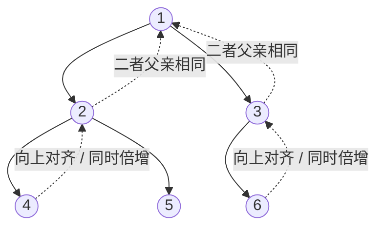

# 最近公共祖先（LCA）

在有根树中，$u,v$ 的最近公共祖先是同时为二者祖先且深度最大的节点。LCA 是树上距离、路径统计和树上差分的基础。

## 倍增预处理

`up[k][u]` 表示 $u$ 向上走 $2^k$ 步到达的祖先：

$$
up[k][u]=up[k-1][up[k-1][u]].
$$

这个定义也是预处理的不变量。$k=0$ 时由 DFS 得到直接父亲；若第 $k-1$ 层正确，连续跳两次 $2^{k-1}$ 条父边就恰好走 $2^k$ 步，因此递推由归纳法成立。

查询分两步：先把更深的点提升到同深度；若两点不同，再从大到小尝试同时上跳，只在跳后祖先仍不相同时跳。最终二者父亲就是 LCA。

为什么不会跳过答案？当两个 $2^k$ 级祖先不同，它们都还严格位于 LCA 下方，可以安全同时上跳；若祖先相同，该步可能到达或越过 LCA，必须保留当前位置。所有步长检查完后，两点仍不同而父亲相同，这个共同父亲就是深度最大的公共祖先。



例如查询 4 与 6：它们深度相同，最大步长的祖先若相同就不能直接跳过去；分别停在 2、3 后，二者父亲同为 1，因此答案是 1。

```cpp
int lca(int u, int v) {
    if (depth[u] < depth[v]) swap(u, v);
    int diff = depth[u] - depth[v];
    for (int k = 0; k < LOG; ++k)
        if ((diff >> k) & 1) u = up[k][u];
    if (u == v) return u;
    for (int k = LOG - 1; k >= 0; --k) {
        if (up[k][u] != up[k][v]) {
            u = up[k][u];
            v = up[k][v];
        }
    }
    return up[0][u];
}
```

预处理 DFS 中令根的所有越界祖先都为根本身，可减少特判。复杂度：预处理 $O(n\log n)$，单次查询 $O(\log n)$，空间 $O(n\log n)$。

### 手算例题

根 1 的孩子为 2、3；2 的孩子为 4、5；3 的孩子为 6。`LCA(4,5)=2`，`LCA(4,6)=1`，`LCA(2,5)=2`（祖先可以是节点自身）。

## 树上距离

无权树：

$$
dist(u,v)=depth[u]+depth[v]-2\cdot depth[lca(u,v)].
$$

带权树把 `depth` 换成根到点的权值和即可。

## 欧拉序 + RMQ 思路

DFS 每次进入节点和从孩子返回时记录节点，得到长度约 $2n-1$ 的欧拉序；两个节点首次出现位置之间深度最小的节点就是 LCA。可用 ST 表做 RMQ。该法预处理 $O(n\log n)$、查询 $O(1)$，但代码更长。

## 真题：P3379 最近公共祖先

[洛谷 P3379【模板】最近公共祖先](https://www.luogu.com.cn/problem/P3379) 给出树根和多次 LCA 查询。预处理时让 `up[0][root]=root`，后续高层祖先都会保持为根，查询中无需访问无意义的 0 号祖先。

```cpp
#include <bits/stdc++.h>
using namespace std;

int main() {
    ios::sync_with_stdio(false);
    cin.tie(nullptr);

    int n, queries, root;
    cin >> n >> queries >> root;
    vector<vector<int>> graph(n + 1);
    for (int i = 1; i < n; ++i) {
        int u, v;
        cin >> u >> v;
        graph[u].push_back(v);
        graph[v].push_back(u);
    }

    int log = 1;
    while ((1 << log) <= n) ++log;
    vector<vector<int>> up(log, vector<int>(n + 1));
    vector<int> depth(n + 1);

    function<void(int,int)> dfs = [&](int u, int parent) {
        up[0][u] = parent;
        for (int level = 1; level < log; ++level)
            up[level][u] = up[level - 1][up[level - 1][u]];
        for (int v : graph[u]) {
            if (v == parent) continue;
            depth[v] = depth[u] + 1;
            dfs(v, u);
        }
    };
    dfs(root, root);

    auto lca = [&](int u, int v) {
        if (depth[u] < depth[v]) swap(u, v);
        int difference = depth[u] - depth[v];
        for (int level = 0; level < log; ++level)
            if ((difference >> level) & 1) u = up[level][u];
        if (u == v) return u;
        for (int level = log - 1; level >= 0; --level) {
            if (up[level][u] != up[level][v]) {
                u = up[level][u];
                v = up[level][v];
            }
        }
        return up[0][u];
    };

    while (queries--) {
        int u, v;
        cin >> u >> v;
        cout << lca(u, v) << '\n';
    }
    return 0;
}
```

预处理 $O(n\log n)$，每次询问 $O(\log n)$，空间 $O(n\log n)$。若树可能是一条很深的链，应把递归 DFS 改为显式栈以避免调用栈溢出。

## 易错点

- 没有先对齐深度。
- 从小到大同时跳，可能越过最近祖先；第二阶段必须从大到小。
- `LOG` 不足，通常取满足 $2^{LOG}>n$。
- 根的父亲设为 0，但 `depth[0]`、`up[*][0]` 没有一致初始化。
